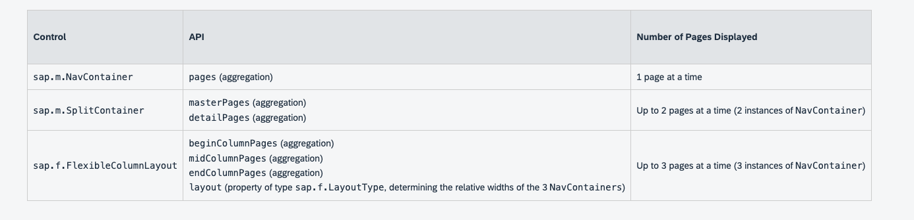

# Flexible Column Layout

`sap.f.FlexibleColumnLayout` implement list-detail-detail bằng cách hiển thị tối đa 3 page trong các cột khác biệt

Thường sử dụng các app cần hiện thị nhiều cấp độ logic của thông tin liên quan đến nhau,
Ví dụ: list of items, item ,sub-item. Nó linh hoạt ,app có thể tập trung sự chú ý của user vào một cột cụ thể bằng cách làm nó lơn hơn hoặc fullscreen

## Control Structure

`sap.f.FlexibleColumnLayout` chưa 3 page `sap.m.NavContainer`- một page bằng 1 cột

- Về logic, nó tượng tự như `sap.SplitContainer`, nhưng khác ở điểm
  - Hiển thị tối đa 3 columns cạnh nhau(trái ngược với 2 cột)
  - Độ rộng của các cột linh hoạt(được xác dịnh bởi thuộc tính layout)

## Types of Layout: https://sapui5.hana.ondemand.com/#/topic/3b9f760da5b64adf8db7f95247879086

## Layout Arrows

Layout Arrows được sử dụng thay đổi layout hiện tại của `FlexColumnLayout`

Layout Arrows là cáhc duy nhất để layout thay đổi cấp độ mà không app thay đổi một cách rõ ràng.Những thay đổi về layout do tương tác các layout arrows chỉ từ một kiểu layout 2 cột khác hăocj từ một kiểu layout 3 cột này sáng một kiểu layout khác.

In a TwoColumsBeginExpanded layout there is one arrow that changes it to TwoColumnsMidExpanded.

In a TwoColumnsMidExpanded layout there is one arrow that changes it to TwoColumnsBeginExpanded.

In a ThreeColumnsMidExpanded layout there are two arrows that allow changing the layout either to a ThreeColumnsEndExpanded or to ThreeColumnsMidExpandedEndHidden layout.

# Reacting to Layout Change (phản ứng với nhau thay đổi của layout)

cung cấp event `stateChange` cho `FlexibleColumnLayout`

event được kích hoạt khi:

- Layout thy đổi vì người đã cọn layout arrow
- Người dùng thay đổi kích thước trình duyệt vượt quá 960/1280px , Diều này không thay đổi layout nhưng thay đổi số lựung cột hiện thì cùng 1 lúc

App có thể đăng ký event để thay đổi layout, vd:show/hide, chẳng nút fullscreen và close
