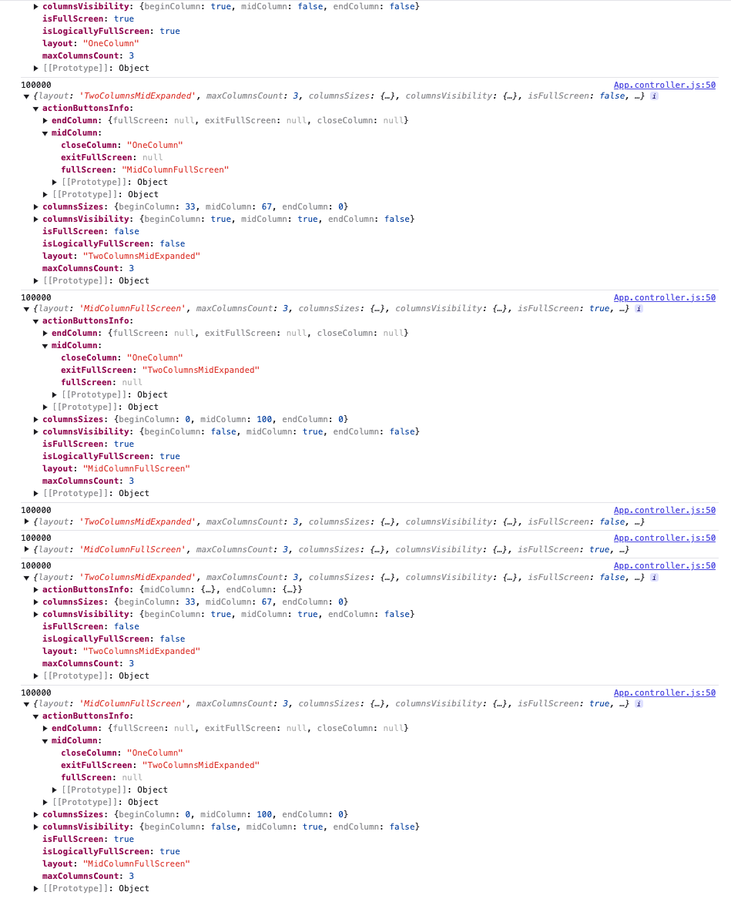

# Flexible Column Layout Semantic Helper

helper class, được thiêt kế thuận lợi cho việc triển khai các app dựa trên `sap.f.FlexibleColumnLayout`.

Nguyên nhân:
FlexibleColumnLayout cho phép bạn tự do implement bất kì logic app nào liên quan đến layout.(show/hiding) do action của user.Nhưng, một số UX cần tối ưu dùng `FlexColumnLayoutSemanticHelper` giúp bạn implement chúng bằng cách cung cấp các mẹo về layout

Nó `NOT` bắt buộc để xây dựng với `FlexColumnLayout`, nhưng hiệu quả về UX

ví dụ
detail-page,List,detail-detail

Nếu có 3 trang trên nó sẽ được hiển thị trên 3 cột cạnh nhau,

Nếu thêm `aboutpage` sẽ được hiển trong EndColumnFullScreen. Nếu bất cứ khi nào user mở 1 trang ở chế độ fullScreen thì tất cả các page khác đều hiển thị chế độ fullScreen

Quy tắc:

- Start OneColumn layout(thường hiển thị các item), hiển thị trang List
- Khi user nhấn vào 1 item bất kì, chi tiết của item đó được hiển thị ,bố cục thay đổi thành `TwoColumnsBeginExpanded` và hiển thị 2 trang `List` và `Detail`. Đồng thời, hai button `FullScreen` và `Close` sẽ hiển thị
  - Việc click vào Close sẽ thay đổi layout về OneColumn, trở về trang List
  - Chọn `FullScreen` sẽ thay đổi thành `MidColumnFullScreen`, hiển thi mình trang Detail.Sau đó button `FullScreen` thay bằng button `ExitFullScreen`, sau khi bấm nó sẽ khôi phục layout `TwoColumnsBeginExpanded`, chuyển thành trnag List và Detail
- Nếu user chọn 1 item ở Detail
  - Nếu layout đang là TwoColumnsBeginExpanded/TwoColumnsMidExpanded ,2 trang List và Detail sẽ đổi thành `ThreeColumnsMidExpanded`, 3 trang List và Detail,Detail-Detail.Các button `Close` và `FullScreen` giờ chỉ hiện ở `Detail-Detail`.
  - Nếu layout là `MidColumnFullScreen` (full màn Detail page),layout sẽ đổi thành `EndColumnFullscreen`(full trang detail-detail)
- Nếu user chọn item từ `detail-detail`,layout sẽ thành `EndColumnFullscreen` và cấp độ logic sẽ được hiện thị nhưu thế.

## Main Methods

Có 2 method được dùng trong `sap.f.FlexibleColumnLayoutSemanticHelper`.

`getCurrentUIState()` : method return về 1 Object, cung cấp thông tin hiện tại của FlexibleColumnLayout

- layout hiện tại
- Kích thước của từng cột, thể hiện cột hiển thị
- Liệu control có được đặt ở chế toàn màn hình hay không
- App sẽ hiển thị các button action, trong cột nào và layout nào sẽ được gọi khi button này được chọn

```js
{
	   "layout":"ThreeColumnsMidExpanded",
	   "maxColumnsCount":3,
	   "columnsSizes":{
		  "beginColumn":25,
		  "midColumn":50,
		  "endColumn":25
	   },
	   "columnsVisibility":{
		  "beginColumn":true,
		  "midColumn":true,
		  "endColumn":true
	   },
	   "isFullScreen":false,
	   "isLogicallyFullScreen":false,
	   "actionButtonsInfo":{
		  "midColumn":{
			 "fullScreen":null,
			 "exitFullScreen":null,
			 "closeColumn":null
		  },
		  "endColumn":{
			 "fullScreen":"EndColumnFullScreen",
			 "exitFullScreen":null,
			 "closeColumn":"TwoColumnsBeginExpanded"
		  }
	   }
	}

```



- `getNextUIState(iNextLevel)`:Method này sẽ chuyển đổi layout nào,sau khi action buttoon sẽ được hiển thị mức độ logic khác. Argument `iNextlevel` .o dành cho init.1- danh cho list và detail,2 detail và detail-detail,3 trở lên dành cho logic tiếp theo.

Nếu layout hiện tại `OneColumn`(chỉ hiển thị page List), user chon item của page List và chi tiết của detail hiển thị. Để xác định layout hãy gọi `getNextUiState(1)`.Nó trả layout `TwoColumnBeginExpanded`.Sau này user chọn 1 item của detail, hãy gọi `getNextUIState(2)` để xác định layout cho detail-detail.Ngoài ra, nếu user chọn một item trong List,hãy gọi lại `getNextUIState(1)` để xác định layout thích hợp để chuyển page.

```js
{
	   "layout":"ThreeColumnsMidExpanded",
	   "maxColumnsCount":3,
	   "columnsSizes":{
		  "beginColumn":25,
		  "midColumn":50,
		  "endColumn":25
	   },
	   "columnsVisibility":{
		  "beginColumn":true,
		  "midColumn":true,
		  "endColumn":true
	   },
	   "isFullScreen":false,
	   "isLogicallyFullScreen":false,
	   "actionButtonsInfo":{
		  "midColumn":{
			 "fullScreen":null,
			 "exitFullScreen":null,
			 "closeColumn":null
		  },
		  "endColumn":{
			 "fullScreen":"EndColumnFullScreen",
			 "exitFullScreen":null,
			 "closeColumn":"TwoColumnsBeginExpanded"
		  }
	   }
	}

```
