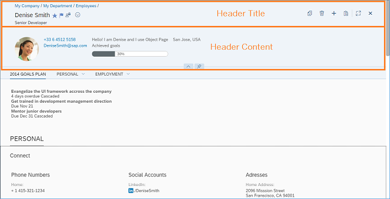
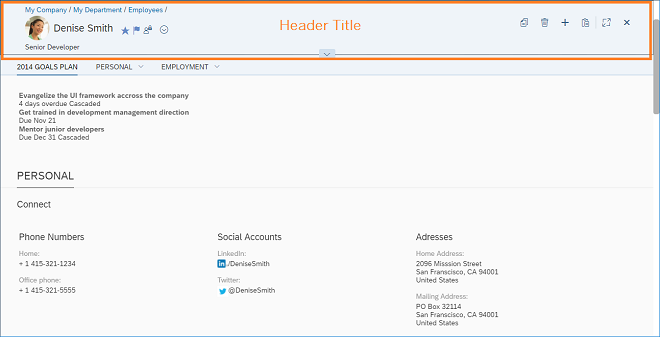

# Object Page Header

`sap.uxap.ObjectPageLayout` có 2 loại header- classic header và dynamic header

`sap.uxap.ObjectPageLayout` triển khai khái niệm header concept. Có nghĩa là header(Header Title) luôn hiển thị, phần dưới (Header Content) có thể cuộn

Thông tin quan trọng mô tả đối tượng, tiêu đề, phụ đề, image nằm trong vùng `Header Content` khi header được mở rộng và di chuyển đến khu vực Header Title nó được thu gọn

sap.uxap.ObjectPageLayout header in expanded state

sap.uxap.ObjectPageLayout Header in Collapsed (snapped) State
