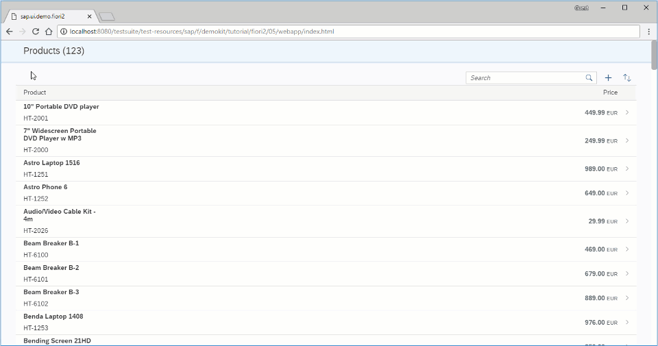

# Using Object Page Layout as a Detail Page (Sử dụng Bố cục trang làm page chi tiết)

Thêm `sap.uxap.ObjectPageLayout` đến detail page hiển thị thông tin từng product.

`ObjectPageLayout` cung cấp 1 layout cho phép app hiển thị thông tin liên quan.

Ở version 1.52, có thể control header động sử dụng bằng `sap.f.DynamicPage`. Điều này đảm bảo tính khả dụng của các tính năng SAP Fiori. ví dụ như navigation,action navigation, expanding/collapsing the header by tapping/clicking the title area bằng cách chọn mũi tên có sẵn

So sánh `sap.f.DynamicPage`, `sap.uxap.ObjectPageLayout` có thể cung cấp nội dung chặt chẽ hơn bằng cách sử dụng `thanh neo` tuỳ chọn



```json title='manifest.json'
"libs": {
				"sap.ui.core": {},
				"sap.m": {},
				"sap.f": {},
				"sap.uxap": {}
				}
```

Thêm các libraries trong manifest.json và ui5.yaml

```xml title="Detail.view.xml"
<mvc:View
	xmlns="sap.uxap"
	xmlns:m="sap.m"
	xmlns:f="sap.f"
	xmlns:form="sap.ui.layout.form"
	xmlns:mvc="sap.ui.core.mvc">
	<ObjectPageLayout
		id="ObjectPageLayout"
		showTitleInHeaderContent="true"
		alwaysShowContentHeader="false"
		preserveHeaderStateOnScroll="false"
		headerContentPinnable="true"
		isChildPage="true"
		upperCaseAnchorBar="false">
	</ObjectPageLayout>
</mvc:View>
```

Thêm một instance `sap.uxap.ObjectPageLayout`

````xml title="Detail.view.xml"
<headerTitle>
			<ObjectPageDynamicHeaderTitle>
				<actions>
					<m:ToggleButton
						text="Edit"
						type="Emphasized"/>
					<m:Button
						text="Delete"
						type="Transparent"/>
					<m:Button
						text="Copy"
						type="Transparent"/>
					<m:Button
						icon="sap-icon://action"
						type="Transparent"/>
				</actions>
			</ObjectPageDynamicHeaderTitle>
		</headerTitle>
```

Thêm dynamic header cùng `ObjectPageDynamicHeaderTitle` trong `headerTitle` aggregation thuộc `ObjectPageLayout`

Tham khảo :
Object Page Headers:https://sapui5.hana.ondemand.com/#/topic/d2ef0099542d44dc868719d908e576d0
Object Page Layout:https://sapui5.hana.ondemand.com/#/topic/2e61ab6c68a2480eb666c1927a707658
Object Page Blocks:https://sapui5.hana.ondemand.com/#/topic/4527729576cb4a4888275b6935aad03a
Object Page Dynamic Header: https://sapui5.hana.ondemand.com/#/topic/6e340c119ddd4c778b315f65a0432420
Khác nhau giữa Classic Header và Dynamic Header :https://sapui5.hana.ondemand.com/#/topic/9c9d94fd28284539a9a5a57e9caf82a8
````
