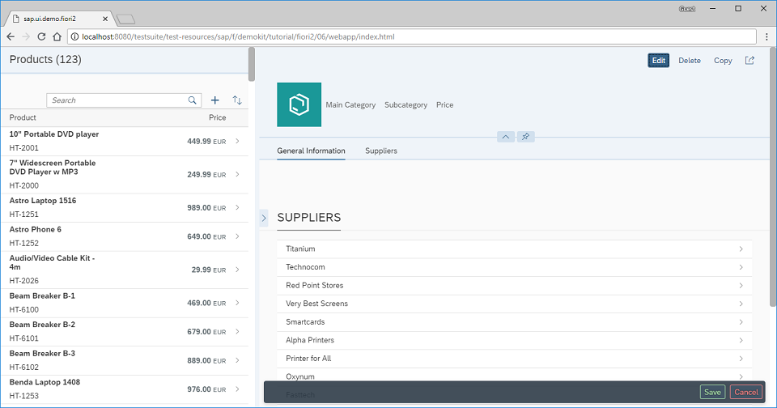

# Adding a Floating Footer (Thêm Footer nổi)

Thêm footer nổi vào detail page



```xml
<mvc:View
	displayBlock="true"
	height="100%"
	xmlns="sap.f"
	xmlns:mvc="sap.ui.core.mvc">
	<FlexibleColumnLayout id="flexibleColumnLayout" stateChange="onStateChanged" backgroundDesign="Solid">
		<beginColumnPages>
			<mvc:XMLView id="beginView" viewName="sap.ui.demo.fiori2.view.List"/>
		</beginColumnPages>
		<midColumnPages>
			<mvc:XMLView id="detailView" viewName="sap.ui.demo.fiori2.view.Detail"/>
		</midColumnPages>
	</FlexibleColumnLayout>
</mvc:View>
```

Thêm event `stateChange` vào `FlexibleColumnLayout`:khi kích hoạt thay đổi bố cục hoặc số lượng column tối đá có thể hiển thị

- Property Layout được thay đổi gián tiếp bằng cách kéo dấu phân cách column hoặc nhấp vào mũi tên của nó
- Người dùng thay đổi kích thước window, vươt quá điểm dừng, do đó số lượng thay đổi

Lưu ý: Sự kiện bị chặn trong khi điều khiển có chiều rộng bằng 0 và sẽ được kích hoạt vào lần đầu tiên nó có chiều rộng khác 0

```xml title="Detail"
		</sections>

		<footer>
			<m:OverflowToolbar>
				<m:ToolbarSpacer/>
				<m:Button type="Accept" text="Save"/>
				<m:Button type="Reject" text="Cancel"/>
			</m:OverflowToolbar>
		</footer>
	</ObjectPageLayout>
</mvc:View>
```

Thêm footer vào `sap.uxap.ObjectPageLayout`

```xml title="Detail.view.xml"
<mvc:View
	controllerName="sap.ui.demo.fiori2.controller.Detail"
	xmlns="sap.uxap"
	xmlns:m="sap.m"
	xmlns:f="sap.f"
	xmlns:form="sap.ui.layout.form"
	xmlns:mvc="sap.ui.core.mvc">
	<ObjectPageLayout
		id="ObjectPageLayout"
		showTitleInHeaderContent="true"
		alwaysShowContentHeader="false"
		preserveHeaderStateOnScroll="false"
		headerContentPinnable="true"
		isChildPage="true"
		upperCaseAnchorBar="false">
		<headerTitle>
			<ObjectPageDynamicHeaderTitle>
				<actions>
					<m:ToggleButton
						text="Edit"
						type="Emphasized"
						press=".onEditToggleButtonPress"/>
					<m:Button
						text="Delete"
						type="Transparent"/>
					<m:Button
						text="Copy"
						type="Transparent"/>
					<m:Button
						icon="sap-icon://action"
						type="Transparent"/>
				</actions>
			</ObjectPageDynamicHeaderTitle>
		</headerTitle>
```

press event handler to the Edit button.

```js
sap.ui.define(["sap/ui/core/mvc/Controller"], function (Controller) {
  "use strict";

  return Controller.extend("sap.ui.demo.fiori2.controller.Detail", {
    onEditToggleButtonPress: function () {
      var oObjectPage = this.getView().byId("ObjectPageLayout"),
        bCurrentShowFooterState = oObjectPage.getShowFooter();

      oObjectPage.setShowFooter(!bCurrentShowFooterState);
    },
  });
});
```

function `onEditToggleButtonPress` xử lý ẩn hiển footer
