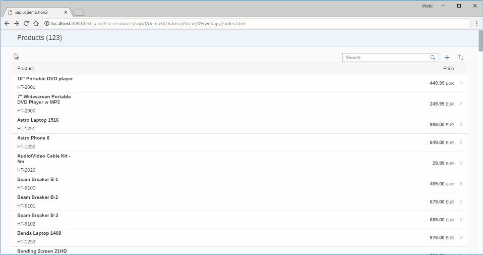

# Adding a Detail-Detail Page (Thêm chi tiết trong detail Page)

Thêm detail-detail page using `sap.f.DynamicPage`, được mở bằng cách chọn từ supplier của detail page



Tạo detail-detail page sử dụng `sap.f.DynamicPage` chỉ 1 tiêu đề

```js title="DetailDetail"
sap.ui.define(
  ["sap/ui/model/json/JSONModel", "sap/ui/core/mvc/Controller"],
  function (JSONModel, Controller) {
    "use strict";

    return Controller.extend("sap.ui.demo.fiori2.controller.DetailDetail", {
      onInit: function () {
        var oOwnerComponent = this.getOwnerComponent();

        this.oRouter = oOwnerComponent.getRouter();
        this.oModel = oOwnerComponent.getModel();

        this.oRouter
          .getRoute("detailDetail")
          .attachPatternMatched(this._onPatternMatch, this);
      },

      _onPatternMatch: function (oEvent) {
        this._supplier =
          oEvent.getParameter("arguments").supplier || this._supplier || "0";
        this._product =
          oEvent.getParameter("arguments").product || this._product || "0";

        this.getView().bindElement({
          path: "/ProductCollectionStats/Filters/1/values/" + this._supplier,
          model: "products",
        });
      },

      onExit: function () {
        this.oRouter
          .getRoute("detailDetail")
          .detachPatternMatched(this._onPatternMatch, this);
      },
    });
  }
);
```

Tạo detail-detail page controller

```json
			...
			"routes": [
				{
					"pattern": ":layout:",
					"name": "list",
					"target": [
						"list",
						"detail"
					]
				},
				{
					"pattern": "detail/{product}/{layout}",
					"name": "detail",
					"target": [
						"list",
						"detail"
					]
				},
				{
					"pattern": "detail/{product}/detailDetail/{supplier}/{layout}",
					"name": "detailDetail",
					"target": [
						"list",
						"detail",
						"detailDetail"
					]
				}
			],
			"targets": {
				"list": {
					"name": "List",
					"controlAggregation": "beginColumnPages"
				},
				"detail": {
					"name": "Detail",
					"controlAggregation": "midColumnPages"
				},
				"detailDetail": {
					"name": "DetailDetail",
					"controlAggregation": "endColumnPages"
				}
			}
		}
	}
}
```

Thêm detail-detail page vào routes `manifest.json`

```xml
			...
			<ObjectPageSection title="Suppliers">
				<subSections>
					<ObjectPageSubSection>
						<blocks>
							<m:Table
								id="suppliersTable"
								items="{path : 'products>/ProductCollectionStats/Filters/1/values'}">
								<m:columns>
									<m:Column/>
								</m:columns>
								<m:items>
									<m:ColumnListItem type="Navigation" press=".onSupplierPress">
										<m:cells>
											<m:ObjectIdentifier text="{products>text}"/>
										</m:cells>
									</m:ColumnListItem>
								</m:items>
							</m:Table>
						</blocks>
					</ObjectPageSubSection>
				</subSections>
			</ObjectPageSection>
		</sections>
```

thêm press event handle cho từng SUPPLIERS ở detail page

```js
sap.ui.define([
	"sap/ui/core/mvc/Controller",
	'sap/f/library'
], function (Controller, fioriLibrary) {
	"use strict";

	return Controller.extend("sap.ui.demo.fiori2.controller.Detail", {
		onInit: function () {
			var oOwnerComponent = this.getOwnerComponent();

			this.oRouter = oOwnerComponent.getRouter();
			this.oModel = oOwnerComponent.getModel();

			this.oRouter.getRoute("list").attachPatternMatched(this._onProductMatched, this);
			this.oRouter.getRoute("detail").attachPatternMatched(this._onProductMatched, this);
			this.oRouter.getRoute("detailDetail").attachPatternMatched(this._onProductMatched, this);
		},

		onSupplierPress: function (oEvent) {
			var supplierPath = oEvent.getSource().getBindingContext("products").getPath(),
				supplier = supplierPath.split("/").slice(-1).pop();

			this.oRouter.navTo("detailDetail", {layout: fioriLibrary.LayoutType.ThreeColumnsMidExpanded, supplier: supplier, product: this._product});
		},

		_onProductMatched: function (oEvent) {
```

Thêm function `onSupplierPress` detail page controller truyền data selected `supplier` và navigate đến detail-detail page

```js
		...
		onRouteMatched: function (oEvent) {
			var sRouteName = oEvent.getParameter("name"),
				oArguments = oEvent.getParameter("arguments");

			// Save the current route name
			this.currentRouteName = sRouteName;
			this.currentProduct = oArguments.product;
			this.currentSupplier = oArguments.supplier;
		},

		onStateChanged: function (oEvent) {
			var bIsNavigationArrow = oEvent.getParameter("isNavigationArrow"),
				sLayout = oEvent.getParameter("layout");

			// Replace the URL with the new layout if a navigation arrow was used
			if (bIsNavigationArrow) {
				this.oRouter.navTo(this.currentRouteName, {layout: sLayout, product: this.currentProduct, supplier: this.currentSupplier}, true);
			}
		},

		onExit: function () {
			this.oRouter.detachRouteMatched(this.onRouteMatched, this);
		}
	});
});
```
